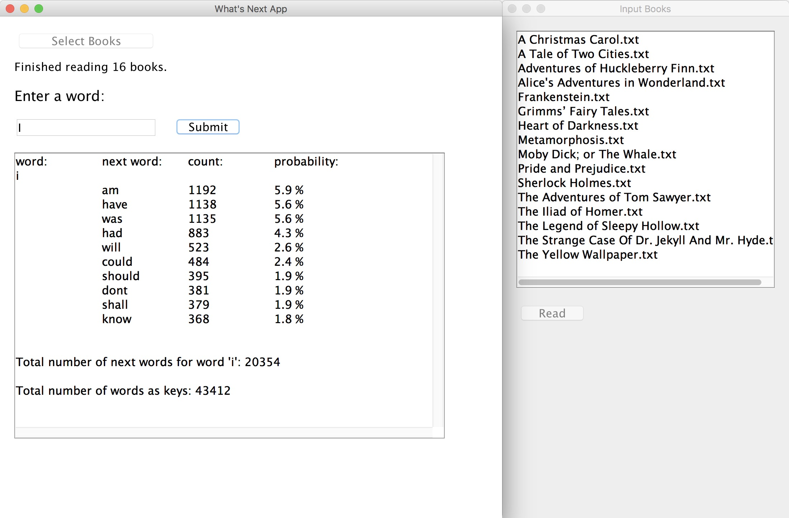

Side Project
============
Kei Fukutani

## Goal
This app allows user to know the tendency of following words.  
When user types in a word, this app displays a list of words that follow the word and the probability of the word following based on a text file/files.   

## Example 
If user types in "go", then a list of words as shown below will be displayed, which means a word "to" follows the word "go" with probability of 13.1 %, "and" follows "go" with probability of 8.5 %, and "on" follows "go" with probability of 6.0 %.  

## Design 
* **File Parser** reads lines from a text file using Text Analyzer. 
* **Text Analyzer** splits lines into words and keeps track of the count of the next word. It also computes the probability of the next word showing up. The probability is computed as the following.  
    *Probability* = (The count of the next word) / (The sum of the counts of all the next words)

* **Data Structure** stores words, next words, and probability. 
* **User Interface** provides a user with text field that the user type in a word and button that displays the result.  
This runs in a separate thread from main thread. 

## User Interface
First, user presses the button "Select Books" , and selects text files. Then, press the button "Read" on the panel to the right of main panel. The app starts reading the text files the user has selected. After the app has finished reading those books, the user enters a word in the text field and presses the submit button, and this app displays a list of the next words and the probability. 

## Implementation 
* In the **Data Structure**, Map1 maps one word to Map2 that maps the next word to its count. 
* The **User Interface** is provided by the javax.swing package which contains JFrame, JPanel, JTextfield, etc. 

